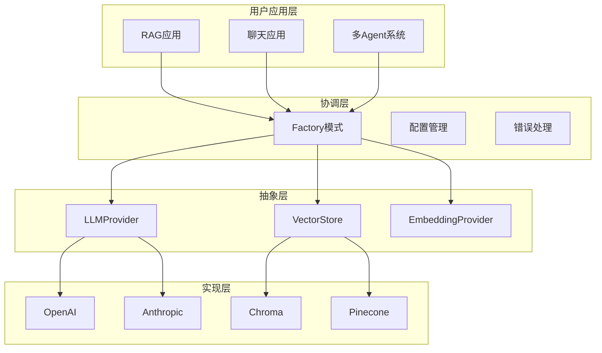

# 🧱 AI Modular Blocks - 模块化AI开发框架

> "Bad programmers worry about the code. Good programmers worry about data structures and their relationships." - Linus Torvalds

## 🎯 项目概述

### 核心理念
构建一个类似**shadcn/ui**的模块化AI开发体系 - 提供可组合、可替换的AI功能构建块，让开发者像搭乐高一样构建AI应用。

### 为什么选择模块化而不是框架？

| 传统AI框架 | AI Modular Blocks |
|------------|-------------------|
| ❌ 框架锁定，难以替换组件 | ✅ 完全控制，随时替换 |
| ❌ 黑盒实现，调试困难 | ✅ 透明实现，完全可控 |
| ❌ 统一瓶颈，性能受限 | ✅ 针对性优化，性能最优 |
| ❌ 版本升级风险高 | ✅ 渐进式升级，稳定可靠 |

## 🤔 设计出发点：为什么重新发明轮子？

### 现有AI框架生态的根本问题

我们在构建生产级AI应用时，发现现有主流框架都存在根本性的设计缺陷。让我们逐一分析：

## 📊 主流框架对比分析

### 1. LangChain：过度抽象的"链式地狱"

#### LangChain的根本问题

**过度抽象导致的复杂性**：
```python
# 为了做个简单的LLM调用，你需要创建一堆对象
from langchain.chains import LLMChain, SimpleSequentialChain
from langchain.prompts import PromptTemplate

prompt = PromptTemplate(...)                    # 1. 创建Prompt模板
llm_chain = LLMChain(llm=llm, prompt=prompt)   # 2. 创建Chain
seq_chain = SimpleSequentialChain(chains=[llm_chain])  # 3. 包装成Sequential
result = seq_chain.run(input_text)             # 4. 黑盒执行

# 🤷‍♂️ 你根本不知道内部发生了什么！
```

**调试困难的黑盒设计**：
```python
try:
    result = complex_chain.run(input_text)
except Exception as e:
    # 😱 错误可能来自Chain的任何环节，调试nightmare
    print(f"Chain failed: {e}")
```

**性能开销的抽象税**：
```
用户调用 → Chain.run() → LLMChain._call() → BaseLLM.generate() → 实际API调用
         ⬆️ 4层抽象 + 框架开销
```

### 2. LangGraph：复杂状态管理的新陷阱

LangGraph试图解决LangChain的一些问题，但引入了更多复杂性：

#### LangGraph的问题

**过度工程化的状态管理**：
```python
from langgraph.graph import StateGraph
from langgraph.checkpoint.memory import MemorySaver

# 为了实现一个简单的对话，你需要：
def create_graph():
    workflow = StateGraph(AgentState)
    
    # 定义节点
    workflow.add_node("agent", call_model)
    workflow.add_node("action", call_tool)
    
    # 定义边
    workflow.add_edge(START, "agent")
    workflow.add_conditional_edges(
        "agent",
        should_continue,
        {"continue": "action", "end": END}
    )
    workflow.add_edge("action", "agent")
    
    # 编译图
    checkpointer = MemorySaver()
    app = workflow.compile(checkpointer=checkpointer)
    return app

# 🤯 为了一个对话，需要理解图、节点、边、状态、检查点...
```

**复杂的状态同步问题**：
```python
# LangGraph中状态管理的复杂性
class AgentState(TypedDict):
    messages: Annotated[list, add_messages]
    current_tool: str
    step_count: int
    intermediate_results: list

# 状态在多个节点间传递，调试复杂
# 状态冲突、竞态条件、内存泄漏等问题
```

**学习曲线陡峭**：
- 需要理解图论概念
- 复杂的状态注解系统
- 检查点和恢复机制
- 条件边和动态路由

### 3. 我们的解决方案：回归本质

#### 简洁直接的实现

**透明的执行流程**：
```python
# 我们的方式：直接、透明、可控
llm = LLMProviderFactory.create_provider("openai", config)
messages = [ChatMessage(role="user", content=input_text)]
result = await llm.generate(messages)

# ✅ 完全知道每一步在做什么，零学习成本
```

**显式的状态管理**：
```python
# 需要状态管理？自己控制，不需要框架
class ConversationManager:
    def __init__(self):
        self.history: List[ChatMessage] = []
        self.context: Dict[str, Any] = {}
    
    async def chat(self, message: str) -> str:
        # 1. 添加用户消息
        self.history.append(ChatMessage(role="user", content=message))
        
        # 2. 生成回复
        response = await self.llm.generate(self.history)
        
        # 3. 更新历史
        self.history.append(ChatMessage(role="assistant", content=response.content))
        
        return response.content

# ✅ 简单、可控、易调试
```

**可组合的多Agent系统**：
```python
# 多Agent协作？组合模式解决
class MultiAgentSystem:
    def __init__(self):
        self.researcher = LLMProviderFactory.create_provider("openai", research_config)
        self.writer = LLMProviderFactory.create_provider("openai", writing_config)
        self.reviewer = LLMProviderFactory.create_provider("anthropic", review_config)
    
    async def collaborative_task(self, task: str) -> str:
        # 1. 研究员收集信息
        research = await self.researcher.generate([
            ChatMessage(role="user", content=f"研究任务: {task}")
        ])
        
        # 2. 写作员生成内容
        content = await self.writer.generate([
            ChatMessage(role="user", content=f"基于研究结果写作: {research.content}")
        ])
        
        # 3. 审核员检查质量
        review = await self.reviewer.generate([
            ChatMessage(role="user", content=f"审核内容: {content.content}")
        ])
        
        return review.content

# ✅ 清晰的职责分工，易于理解和调试
```

## 🔥 实际场景对比：构建RAG系统

### LangChain方式 - 魔法但不可控

```python
from langchain.chains import RetrievalQA
from langchain.vectorstores import Chroma

# 🤔 需要理解一堆概念：Chain, VectorStoreIndex, RetrievalQA等
qa_chain = RetrievalQA.from_chain_type(
    llm=llm,
    chain_type="stuff",  # 🤷‍♂️ 什么是"stuff"？
    retriever=vectorstore.as_retriever(search_kwargs={"k": 4}),
    return_source_documents=True
)

result = qa_chain({"query": question})  # 🤷‍♂️ 内部做了什么？
```

### LangGraph方式 - 过度复杂

```python
from langgraph.graph import StateGraph

# 🤯 为了RAG需要定义复杂的图结构
class RAGState(TypedDict):
    query: str
    documents: list
    context: str
    response: str

def create_rag_graph():
    workflow = StateGraph(RAGState)
    
    workflow.add_node("retrieve", retrieve_documents)
    workflow.add_node("generate", generate_response)
    workflow.add_edge(START, "retrieve")
    workflow.add_edge("retrieve", "generate")
    workflow.add_edge("generate", END)
    
    return workflow.compile()

# 复杂的状态传递，难以调试
```

### 我们的方式 - 显式且可控

```python
async def rag_query(question: str):
    # 1. 检索相关文档 - 你完全知道在做什么
    search_results = await vector_store.search(question, limit=3)
    
    # 2. 构建上下文 - 你控制格式
    context = "\n".join([doc.content for doc in search_results.documents])
    
    # 3. 生成回答 - 你设计prompt
    messages = [
        ChatMessage(role="system", content="基于以下文档回答问题"),
        ChatMessage(role="user", content=f"文档:\n{context}\n\n问题: {question}")
    ]
    
    # 4. 返回结果 - 完全透明
    response = await llm.generate(messages)
    return response.content

# ✅ 简单、直接、可调试
```

## 🏛️ 设计哲学：Unix思想在AI时代的应用

我们遵循Linus Torvalds和Unix的核心哲学：

### "Do One Thing and Do It Well"
- **LangChain/LangGraph**: 试图用复杂框架解决所有AI应用场景
- **我们**: 每个Provider专注一个具体功能，组合解决复杂问题

### "Worse is Better"  
- **LangChain/LangGraph**: 追求"理论完美"的抽象和复杂状态管理
- **我们**: 追求"实际可用"的简洁实现

### "Show Me the Code"
- **LangChain/LangGraph**: 黑盒执行，隐藏实现细节
- **我们**: 透明实现，用户完全可控

## ⚖️ 技术债务全面对比

| 维度 | LangChain | LangGraph | AI Modular Blocks |
|------|-----------|-----------|-------------------|
| **学习成本** | 高（Chain体系） | 极高（图+状态管理） | 低（简单接口） |
| **调试难度** | 高（黑盒执行） | 极高（复杂状态流） | 低（透明实现） |
| **性能开销** | 高（多层抽象） | 极高（状态同步） | 低（直接调用） |
| **版本风险** | 高（breaking changes） | 极高（新框架不稳定） | 低（独立版本） |
| **扩展成本** | 高（复杂继承） | 极高（图结构修改） | 低（简单接口） |
| **状态管理** | 隐式（难控制） | 显式但复杂 | 用户自主控制 |
| **错误处理** | 复杂（链式传播） | 极复杂（图中断恢复） | 精确（异常定位） |

## 🎯 何时选择什么？

### 选择LangChain的场景
- ✅ 快速原型验证（不考虑长期维护）
- ✅ 对性能和可控性要求不高
- ✅ 团队喜欢"开箱即用"的解决方案

### 选择LangGraph的场景  
- ✅ 复杂的多Agent协作（有充足的学习时间）
- ✅ 需要复杂状态管理（团队有图论背景）
- ✅ 研究和实验项目（不是生产环境）

### 选择AI Modular Blocks的场景
- ✅ **生产环境应用**
- ✅ **需要精确控制和性能优化**
- ✅ **长期维护和演进的项目**
- ✅ **团队想要完全理解系统行为**
- ✅ **快速开发和迭代**

> **Linus说**: "Theory and practice sometimes clash. Theory loses. Every single time."
> 
> LangChain和LangGraph都是理论上的"完美"，我们是实践中的"可用"。

## 🚀 快速开始

### 安装

```bash
# 基础安装
pip install ai-modular-blocks

# 带特定provider支持
pip install ai-modular-blocks[openai,chroma]  # LLM + 向量存储
pip install ai-modular-blocks[all]           # 全部功能
```

### 30秒跑起第一个示例

```python
import asyncio
import os
from ai_modular_blocks.providers.llm import LLMProviderFactory
from ai_modular_blocks.core.types import LLMConfig, ChatMessage

async def hello_ai():
    # 1. 创建LLM provider
    config = LLMConfig(
        provider="openai",
        model="gpt-3.5-turbo", 
        api_key=os.getenv("OPENAI_API_KEY")
    )
    
    LLMProviderFactory.initialize()
    llm = LLMProviderFactory.create_provider("openai", config)
    
    # 2. 发送消息
    messages = [ChatMessage(role="user", content="Hello, AI!")]
    response = await llm.generate(messages)
    
    print(f"AI回复: {response.content}")

# 运行
asyncio.run(hello_ai())
```

### 实际应用：构建RAG系统

```python
from ai_modular_blocks.providers.llm import LLMProviderFactory
from ai_modular_blocks.providers.vectorstores import VectorStoreFactory
from ai_modular_blocks.core.types import VectorDocument

async def build_rag_system():
    # 初始化组件
    LLMProviderFactory.initialize()
    VectorStoreFactory.initialize()
    
    # LLM for generation
    llm = LLMProviderFactory.create_provider("openai", llm_config)
    
    # Vector store for retrieval
    vector_store = VectorStoreFactory.create_provider("chroma", vector_config)
    
    # 添加文档
    docs = [
        VectorDocument(id="1", content="Python是一种编程语言...", metadata={"topic": "programming"}),
        VectorDocument(id="2", content="机器学习是AI的分支...", metadata={"topic": "ai"})
    ]
    await vector_store.add_documents(docs)
    
    # RAG查询
    async def rag_query(question: str):
        # 1. 检索相关文档
        results = await vector_store.search(question, limit=3)
        context = "\n".join([doc.content for doc in results.documents])
        
        # 2. 生成回答
        messages = [
            ChatMessage(role="system", content="基于以下上下文回答问题"),
            ChatMessage(role="user", content=f"上下文: {context}\n\n问题: {question}")
        ]
        response = await llm.generate(messages)
        return response.content
    
    # 使用
    answer = await rag_query("什么是Python？")
    print(answer)
```

更多示例见 [`examples/`](../examples/) 目录。

## 🏗️ 架构设计

### 核心架构



### 项目结构

```
ai_modular_blocks/
├── core/                      # 🏛️ 核心抽象层
│   ├── interfaces.py         # 标准接口定义
│   ├── types.py              # 数据类型
│   ├── exceptions.py         # 异常体系
│   ├── config.py             # 配置管理
│   └── base.py               # 基础实现类
├── providers/                 # 🔌 具体实现层
│   ├── llm/                  # LLM提供商
│   │   ├── openai_provider.py
│   │   ├── anthropic_provider.py
│   │   └── factory.py
│   ├── vectorstores/         # 向量存储
│   │   ├── chroma_store.py
│   │   ├── pinecone_store.py
│   │   └── factory.py
│   └── embeddings/           # 嵌入模型
└── utils/                     # 🛠️ 工具层
    ├── caching/              # 缓存策略
    ├── monitoring/           # 性能监控
    └── logging/              # 日志管理
```

## 🔌 核心接口

### LLM Provider接口

```python
class LLMProvider(ABC):
    """LLM提供商标准接口"""
    
    @abstractmethod
    async def generate(
        self,
        messages: MessageList,
        **kwargs
    ) -> LLMResponse:
        """生成回复"""
        pass
    
    @abstractmethod
    async def stream_generate(
        self,
        messages: MessageList,
        **kwargs
    ) -> AsyncGenerator[LLMResponse, None]:
        """流式生成"""
        pass
```

### Vector Store接口

```python
class VectorStore(ABC):
    """向量存储标准接口"""
    
    @abstractmethod
    async def add_documents(
        self,
        documents: DocumentList,
        **kwargs
    ) -> Dict[str, Any]:
        """添加文档"""
        pass
    
    @abstractmethod
    async def search(
        self,
        query: str,
        limit: int = 5,
        **kwargs
    ) -> SearchResult:
        """搜索相似文档"""
        pass
```

## 📊 支持的Provider

### LLM提供商

| Provider | 模型支持 | 状态 | 特性 |
|----------|---------|------|------|
| **OpenAI** | GPT-3.5, GPT-4, GPT-4o | ✅ 生产就绪 | 完整API支持，流式响应 |
| **Anthropic** | Claude-3 Haiku, Sonnet, Opus | ✅ 生产就绪 | 长上下文，安全对齐 |
| **Local Models** | Ollama, vLLM | 🚧 开发中 | 本地部署，隐私保护 |

### 向量存储

| Provider | 部署方式 | 状态 | 特性 |
|----------|---------|------|------|
| **ChromaDB** | 本地/Docker | ✅ 生产就绪 | 免费，易部署 |
| **Pinecone** | 云服务 | ✅ 生产就绪 | 高性能，自动扩展 |
| **Weaviate** | 自托管 | 🚧 开发中 | 开源，图数据库 |

## ⚡ 性能特性

### 连接池管理
- 所有HTTP客户端使用连接池
- 自动重试和指数退避
- 超时和速率限制处理

### 缓存策略
```python
# 自动缓存LLM响应
@cache_result(ttl=3600, cache_type="memory")
async def cached_llm_call(messages):
    return await llm.generate(messages)

# 缓存向量查询结果
@cache_result(ttl=1800, cache_type="redis")
async def cached_vector_search(query):
    return await vector_store.search(query)
```

### 监控指标
```python
# 内置Prometheus指标
llm_requests_total         # LLM请求计数
llm_request_duration_seconds  # LLM请求延迟
vector_search_total        # 向量搜索计数
cache_hit_rate            # 缓存命中率
```

## 🧪 技术规范

### 错误处理

```python
# 统一异常体系
AIBlocksException          # 基础异常
├── ProviderException      # 提供商异常
│   ├── AuthenticationException  # 认证失败
│   ├── RateLimitException      # 速率限制
│   └── TimeoutException        # 请求超时
├── ConfigurationException # 配置错误
└── ValidationException    # 输入验证失败

# 自动重试
@retry(
    stop=stop_after_attempt(3),
    wait=wait_exponential(multiplier=1, min=2, max=10),
    retry=retry_if_exception_type((TimeoutException, RateLimitException))
)
async def robust_llm_call():
    return await llm.generate(messages)
```

### 配置管理

```python
# 环境配置
OPENAI_API_KEY=your-openai-key
ANTHROPIC_API_KEY=your-anthropic-key
PINECONE_API_KEY=your-pinecone-key

# 代码配置
config = LLMConfig(
    provider="openai",
    model="gpt-4",
    api_key=os.getenv("OPENAI_API_KEY"),
    max_tokens=1000,
    temperature=0.7,
    timeout=30.0,
    max_retries=3
)
```

### 测试策略

```bash
# 运行测试套件
pytest tests/ -v --cov=ai_modular_blocks

# 测试覆盖率目标
# 单元测试: >90%
# 集成测试: 核心功能100%
# 性能测试: P99 < 500ms
```

## 🔧 开发指南

### 添加新的Provider

1. **实现接口**
```python
class NewLLMProvider(BaseLLMProvider):
    async def generate(self, messages: MessageList, **kwargs) -> LLMResponse:
        # 实现具体逻辑
        pass
```

2. **注册到工厂**
```python
# 在工厂类中注册
LLMProviderFactory.register_provider("new_provider", NewLLMProvider)
```

3. **添加测试**
```python
class TestNewProvider:
    async def test_generate(self):
        provider = NewLLMProvider(config)
        response = await provider.generate(messages)
        assert response.content
```

### 贡献代码

```bash
# 1. 安装开发依赖
pip install -e ".[dev]"

# 2. 代码质量检查
ruff check .           # 代码检查（替代 flake8 + isort）
ruff format .          # 代码格式化（替代 black）
mypy .                 # 类型检查

# 或者一键修复所有可修复问题
ruff check --fix .     # 自动修复代码问题

# 3. 运行测试
pytest tests/ --cov=ai_modular_blocks

# 4. 清理Python缓存（如果意外提交了）
find . -name "__pycache__" -type d -not -path "./.venv/*" -exec git rm -r --cached {} \; 2>/dev/null || true
```

**⚠️ 注意**: 项目已正确配置`.gitignore`来忽略所有`__pycache__`文件夹。如果你看到这些文件被git跟踪，说明它们在配置前就被添加了，需要手动清理。

### 扩展新功能

想要添加新的抽象层？
1. 在`core/interfaces.py`定义接口
2. 在`core/types.py`添加数据类型
3. 在`providers/`创建具体实现
4. 在`tests/`添加测试用例

## 🏆 最佳实践

### 1. 接口优于实现
```python
# ✅ 好的方式 - 依赖抽象
llm: LLMProvider = factory.create_provider("openai", config)

# ❌ 坏的方式 - 依赖具体实现
llm = OpenAIProvider(config)
```

### 2. 配置外部化
```python
# ✅ 好的方式 - 配置与代码分离
config = load_config_from_env()
llm = factory.create_provider("openai", config)

# ❌ 坏的方式 - 硬编码配置
llm = OpenAIProvider(api_key="sk-hardcoded-key")
```

### 3. 错误处理要彻底
```python
# ✅ 好的方式 - 处理具体异常
try:
    response = await llm.generate(messages)
except RateLimitException:
    await asyncio.sleep(60)  # 等待后重试
except AuthenticationException:
    logger.error("API key invalid")
    raise
```

### 4. 使用工厂模式
```python
# ✅ 好的方式 - 工厂统一管理
LLMProviderFactory.initialize()
llm = LLMProviderFactory.create_provider("openai", config)

# ❌ 坏的方式 - 直接实例化
llm = OpenAIProvider(config)
```

## 📈 性能基准

### 延迟目标

| 操作 | P50 | P99 | 目标 |
|------|-----|-----|------|
| LLM生成 | <2s | <5s | ✅ |
| 向量搜索 | <100ms | <500ms | ✅ |
| 缓存命中 | <5ms | <10ms | ✅ |

### 吞吐量

| Provider | 并发数 | QPS | 状态 |
|----------|--------|-----|------|
| OpenAI | 50 | 100 | ✅ |
| Anthropic | 30 | 60 | ✅ |
| ChromaDB | 100 | 1000 | ✅ |

## 📝 更新日志

### v0.1.0 (当前)
- ✅ 核心LLM providers (OpenAI, Anthropic)
- ✅ 向量存储 (ChromaDB, Pinecone)
- ✅ 完整的类型系统和异常处理
- ✅ 自动重试和缓存
- ✅ 90%+ 测试覆盖率

### 路线图
- 🚧 更多embedding providers
- 🚧 流式处理优化
- 🚧 分布式向量存储
- 🚧 可视化监控面板

## 📌 开发计划 / TODO

- 详细的优化计划与执行清单请见：`docs/TODO.md`
- 覆盖稳定性、可观测性、示例一致性、安全性、CI 与文档等方向。

## 🆘 获取帮助

- 📖 **文档**: 你正在看的就是
- 🐛 **Bug报告**: [GitHub Issues](https://github.com/your-username/ai-modular-blocks/issues)
- 💬 **讨论**: [GitHub Discussions](https://github.com/your-username/ai-modular-blocks/discussions)
- 📧 **邮件**: your-email@example.com

## 📄 许可证

MIT License - 自由使用、修改和分发。

---

**🎯 Linus说**: "Talk is cheap. Show me the code." 

不要光看文档，直接运行 `examples/` 里的代码，比看一千页文档更有用！
